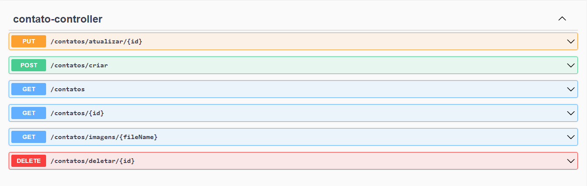

<h1 align="center" style="font-weight: bold;">Agenda de Contatos 💻</h1>

<p align="center">
 <a href="#tech">Tecnologias</a> • 
 <a href="#started">Getting Started</a> • 
  <a href="#routes">Rotas</a> •
 <a href="#colab">Colaboradores</a>
</p>

<p align="center">
    <b>Projeto desenvolvido como teste prático para vaga de Estagiário na empresa Aquora - Tecnologia e Meio Ambiente</b>
</p>

<h2 id="tecnologias">💻 Technologies</h2>

### Backend
- Java 17
- Spring Boot 3.1.5
- Spring Web MVC
- Spring Data JPA
- Spring Validation
- Swagger OpenAPI
- MySQL
- Maven

### Frontend
- Typescript
- HTML5 & CSS3
- Angular 16
- Reactive Forms
- Ngneat/Input-Mask

<h2 id="started">🚀 Getting started</h2>

Para executar o projeto localmente:

<h3>Pré-requisitos</h3>

Você terá que ter instalado em sua máquina:

- [Java 17](https://www.oracle.com/java/technologies/javase/jdk17-archive-downloads.html)
- [Node](https://nodejs.org/en/download)
- [Angular CLI](https://angular.io/cli)
- [MySQL](https://dev.mysql.com/downloads/installer/)
- [Git](https://git-scm.com/downloads)

<h3>Clonar o repositório</h3>

Para clonar o repositório:

```bash
git clone https://github.com/luccasocastro/contatos-aquora.git
```

<h3>"Startando" o projeto</h3>

Para startar o projeto:

### Frontend

```bash
cd contatos-aquora/frontend/
npm install
ng serve
```
(Lembre-se que a rota padrão que está configurada no projeto é a padrão do Spring Boot `localhost:8080`)
### Backend
```bash
cd contatos-aquora/backend/
```
Vá na pasta /resources e renomeie o arquivo `application.properties`, faça as configurações completando os campos de acordo com o que for pedido:
```bash
# Configurações do DataSource para o MySQL
spring.datasource.url=jdbc:mysql://localhost:3306/NOME_DO_SEU_BANCO
spring.datasource.username=SEU_USUARIO
spring.datasource.password=SUA_SENHA

# Configurações do Hibernate
spring.jpa.hibernate.ddl-auto=update
spring.jpa.show-sql=true

# Configuração do caminho para upload das fotos de perfil
file.upload-dir=C:\\seu\\diretorio\\de\\upload\\das\\fotos\\de\\perfil

# Aumentar o tamanho máximo de upload para 20 MB
spring.servlet.multipart.max-file-size=20MB
spring.servlet.multipart.max-request-size=20MB
```
Depois que estiver tudo configurado:
```bash
./mvwn clean package
java -jar target/backend-0.0.1-SNAPSHOT.jar
```

<h2 id="routes">📍 Rotas do Backend</h2>

Aqui estão as rotas principais do Backend
​
| route               | request    | response                                        
|----------------------|-----------------------------------------------------|---------------------------
| <kbd>GET /contatos</kbd>     | | `json` com lista dos contatos
| <kbd>GET /contatos/{id}</kbd>     | id do contato a ser buscado | `json` com as informações do contato
| <kbd>POST /contatos/criar</kbd>     | `json` com `nome`,`email`,`telefone`,`data de nascimento` e `foto de perfil` | `json` com o contato criado
| <kbd>PUT /contatos/atualizar/{id}</kbd>     | id do contato a ser atualizado | `json` com as informações do contato atualizado
| <kbd>DELETE /contatos/deletar/{id}</kbd>     | id do contato a ser deletado | 

<h2>📍 Swagger</h2>

É possível utilizar a interface gráfica do Swagger para testar algumas rotas, basta acessar no navegador a url `http://localhost:8080/swagger-ui.html`

</img>

<h2 id="colab">🤝 Colaboradores</h2>

<table>
  <tr>
    <td align="center">
      <a href="#">
        <br>
        <sub>
          <b>Luccas Souza</b>
        </sub>
      </a>
    </td>
  </tr>
</table>

<h3>Documentações que podem ajudar</h3>

[📝 Como criar um Pull Request](https://www.atlassian.com/br/git/tutorials/making-a-pull-request)

[💾 Padrões de Commit](https://gist.github.com/joshbuchea/6f47e86d2510bce28f8e7f42ae84c716)